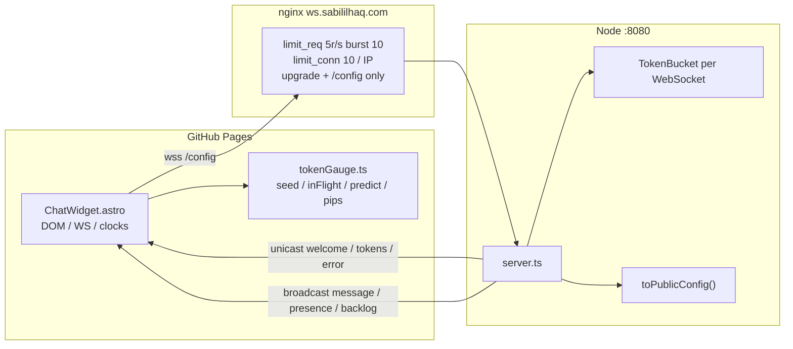
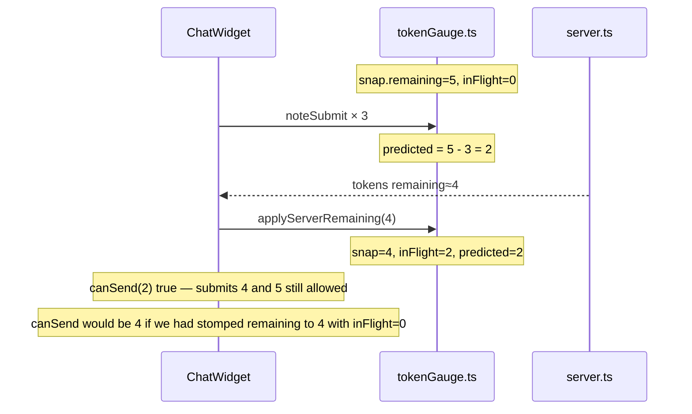
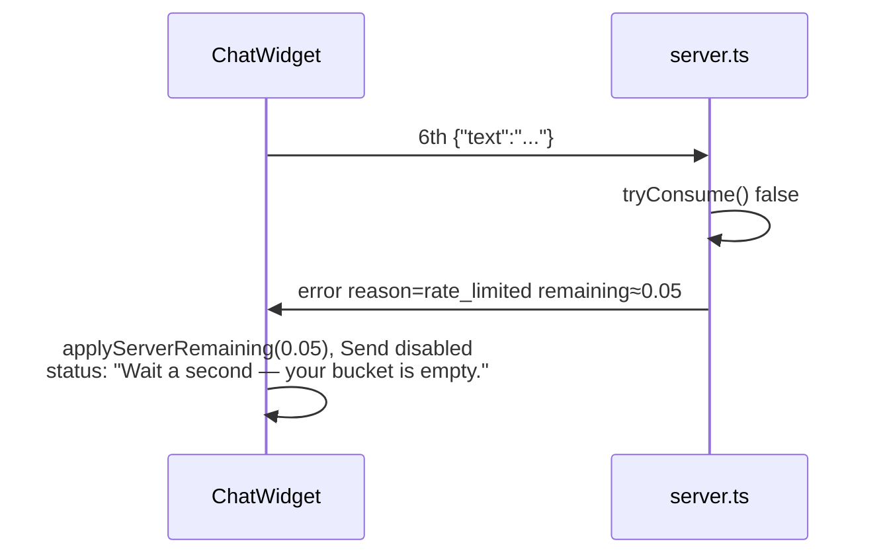

# In-chat token-bucket gauge

| Field | Value |
| --- | --- |
| Author | Sabililhaq (design by Grok) |
| Date | 2026-08-23 |
| Status | Draft |
| Scope | `/chat` composer gauge for the existing per-connection `TokenBucket` |
| Code | `sabililhaq-chat/` (Node WS at `wss://ws.sabililhaq.com`) + `src/components/chat/ChatWidget.astro` (GitHub Pages) |

## Overview

`/chat` is a single anonymous room. Each WebSocket connection already carries a `TokenBucket` (`burst: 5`, `refillPerSec: 1`) that `tryConsume()`s on every inbound frame. That limiter is invisible: the public config omits `rateLimit`, and a rejection is dumped as the raw status string `rate_limited`.

This design makes **your** bucket visible in the composer — five quiet pips next to Send, emptying on send and refilling at one pip per second — without a second room, without knobs, and without teaching the algorithm by spamming the shared room. The server remains the source of truth: unicast frames report the exact remaining float. The client interpolates refill locally so the gauge moves without a 1 Hz WebSocket tick, and tracks in-flight submits so a late `tokens` snapshot cannot raise the gauge mid-mash.

## Background & Motivation

### Current state

The interesting object already exists. On connect, `sabililhaq-chat/src/server.ts` does:

```82:96:sabililhaq-chat/src/server.ts
  clients.set(ws, { nickname, bucket: new TokenBucket() });

  // Welcome frame: tell the client who they are + replay recent history.
  send(ws, { type: "welcome", nickname, config: toPublicConfig() });
  send(ws, { type: "backlog", messages: getLiveMessages() });
  // After this client is in the map so count includes them (and everyone else).
  broadcastPresence();

  ws.on("message", (raw: RawData) => {
    const meta = clients.get(ws);
    if (!meta) return;

    if (!meta.bucket.tryConsume()) {
      send(ws, { type: "error", reason: "rate_limited" });
      return;
    }
```

`TokenBucket` (`sabililhaq-chat/src/rateLimit.ts`) starts full (`tokens = burst`), refills with elapsed wall-clock (`tokens += elapsedSec * refillPerSec`, capped at burst), and denies when `tokens < 1`. Refill is fractional; a pip is not. `tryConsume` already refills and updates `lastRefill` **before** denying; it does not subtract on deny.

Public config deliberately hides the limiter. `toPublicConfig()` returns only `{ expirationSeconds, maxMessageLength }`. `sabililhaq-chat/src/config.test.ts` asserts `rateLimit`, `maxConnections`, and `allowedOrigins` are undefined on the public object. `GET /config` and `welcome.config` share that shape (`server.test.ts` equality-checks both).

`GET /config` (`server.ts` 23–31) has **no origin check** and is cached `Cache-Control: public, max-age=30`. The comment at the top of `config.ts` currently claims “The frontend fetches /config and must never hardcode these values.” That is already false: `ChatWidget.astro` does **not** fetch `/config`. It reads `welcome.config.expirationSeconds` and hardcodes `maxlength="500"` plus the WS URL. The gauge follows the existing welcome-config pattern, not a new `/config` fetch. PR 2 updates the stale comment.

On the client, `ChatWidget.astro` treats every `error` the same:

```589:592:src/components/chat/ChatWidget.astro
					case 'error':
						// Surface server-side rejection reason to users in the widget.
						setStatus(String(data.reason ?? 'Server error'), 'error');
						break;
```

So a user who mashes Send sees the string `rate_limited`. The composer stays enabled. There is no visual of burst or refill. The info panel explains fun-only, the swearing filter, TTL, and "open the Network inspector" — not the bucket.

`sendButton.disabled` is toggled only in `ws.open` (unconditionally `false`, lines 544–546), permanent-disable close, and permanent-disable error — never from remaining tokens. `src/styles/global.css` already has a global `prefers-reduced-motion: reduce` rule (transitions/animations off, **not** `requestAnimationFrame`) and a `.sr-only` helper.

### Pain points

- The lab's constrained-system story (10 s TTL, origin allowlist, 200-connection cap, token bucket) is only half-visible. TTL is live in the info panel; the bucket is not.
- `rate_limited` as a status string is an implementation name, not teaching.
- A client-only mirror would drift: `tryConsume()` runs **before** JSON parse, so invalid payloads, `message_too_long`, and blank frames still spend a token. The UI composer never sends blanks (`input.value.trim()`), but the real bucket does not equal "successful chat sends."
- Spamming the shared room to "feel" the limit is inconsiderate. Other people are in the room. The teaching object is the local gauge.
- Mutating the server snapshot on each submit, then applying the next `tokens` frame as the new remaining, rolls the gauge **forward** mid-mash (late `remaining ≈ 4` restores a burst of 4 while two more sends are already in flight). That would let the composer become the spam trainer this spec forbids.

### What this is not changing

Chat remains one anonymous ephemeral room. Nicknames stay connection-scoped (`generateNickname()`, collisions not deduped). Presence is still `{ type: "presence", count }` with no names. Messages still expire at `CONFIG.expirationSeconds` (10). Obscenity filtering is unchanged.

## Goals & Non-Goals

### Goals

- Show the **connection's** `TokenBucket` in the `/chat` composer as five pips next to Send.
- Server is authoritative for remaining tokens; the client interpolates refill between snapshots and subtracts in-flight submits.
- On empty: composer stays open (you can type), Send disables, status is a human sentence — not `rate_limited`. That sentence fires on the **local** 6th-submit block, not only on a server `rate_limited` the official widget will rarely see.
- Reconnect resets the gauge (new connection = new `TokenBucket` = full burst; nickname may change, existing behavior).
- Distinguish the Node per-connection bucket from nginx IP limits so the gauge does not claim nginx 503s as an empty bucket.
- Backward-compatible protocol: extra fields and one new unicast frame type. Old Pages clients keep working. Deploy server first.
- Extend the existing test contract; do not silently invert `toPublicConfig` leak tests.
- Extract the client bucket state machine into `tokenGauge.ts` so mash-Send and Send re-enable are unit-tested, not trapped in the untestable inline island.

### Non-goals (v1)

- No `/labs/token-bucket` page, no knobs, no running `TokenBucket` in the browser against a fake clock as a product. A follow-up playground that imports the same class and never hits production WS is future work (see Open Questions).
- No second room, accounts, leaderboards, or "who is closest to empty."
- No leaking other connections' remaining tokens. `remaining` is unicast only — never on `message`, `presence`, or `backlog`.
- No presence of nicknames, no change to TTL, origin allowlist, or `maxConnections`.
- No 1 Hz server tick, no per-message metrics, no Grafana-looking widget.
- No teaching mode that auto-sends into the shared room.
- No exposing `maxConnections` or `allowedOrigins`.
- No change to consume-on-any-inbound-frame (the limiter's existing scope). Future control frames (`ping`/`pong`) must not call `tryConsume`; the client already has a dead `case 'ping'` branch and the server does not send pings today.

## Key Decisions

1. **Server-authoritative remaining, client-interpolated refill.** Unicast frames carry the exact float from `TokenBucket`. The client predicts `min(burst, max(0, snap.remaining + elapsed * refillPerSec - inFlight))` so pips refill without a WS tick. Chosen over a pure client mirror (racy with consume-before-parse and clock) and over a 1 Hz tick (200 connections × 1 Hz of vanity frames).

2. **New unicast `tokens` frame on successful consume; `remaining` piggybacked on `welcome` and post-consume `error`s.** Not on the broadcast `message` frame — that would leak sender budget to the room. One extra unicast JSON object per accepted send is the entire hot-path cost. During the server-first window, old Pages clients `console.warn` the full object (including `remaining`) **per accepted send** in DevTools — user-visible noise, not an implementation footnote. Keep the gap to a day.

3. **`rateLimit: { burst, refillPerSec }` becomes public config.** Needed to draw N pips and interpolate. `GET /config` is unauthenticated and will now include it; that is a broader disclosure than “open a WS and send six messages,” but attackers gain no new capability. `maxConnections` and `allowedOrigins` stay private. The leak tests are **updated**, not deleted. Info-panel copy and `aria-valuemax` are templated from `welcome.config.rateLimit`, not frozen at 5 / 1 s.

4. **Integer pips use `floor(remaining)`. While a live gauge exists, Send enables iff `remaining >= 1`.** Matches `tryConsume()` (`tokens < 1` denies). Rounding or ceil would light a pip the server would still reject. The “next” pip may use a gray→black mix from the fractional part so refill is visible across the second; under `prefers-reduced-motion`, pips snap to floor with no analog fill. With no live gauge, Send is enabled (Key Decision 12).

5. **In-flight accounting, not optimistic snapshot mutation.** `noteSubmit` increments `inFlight`; `applyServerRemaining` writes the server float and does `inFlight = max(0, inFlight - 1)`. Predicted remaining subtracts `inFlight`. The 6th submit is blocked when predicted `< 1`. A late `tokens remaining ≈ 4` cannot restore a burst of 4 while submits 2 and 3 are still outstanding. `seedFromWelcome` / `resetGauge` reset `inFlight` to 0. Lost frames over-count `inFlight` until they are matched or until `seedFromWelcome` / `resetGauge`. Elapsed refill can still unlock Send (`snap.remaining + elapsed * refillPerSec - inFlight`). A stale `inFlight` against a later low snap is extra-pessimistic until the next `welcome`.

6. **No periodic remaining tick.** Snapshots exist when the value changes in a way the client cannot know for free (connect, consume, deny). Between those, the formula is deterministic.

7. **Blank/whitespace frames get a `tokens` snapshot and still do not broadcast.** This is a deliberate contract change to `server.test.ts`'s "silently ignores" test: still no `message` and no `error`, but remaining is reported. Composer never sends blanks; this keeps crafted clients' gauges honest. The follow-up `'still alive'` assertion must `find` the `message` frame (the blank’s `tokens` is now `messages[0]`).

8. **Gauge hidden unless `seedSnapshot(welcome.config.rateLimit, welcome.remaining)` succeeds.** Progressive enhancement against a not-yet-upgraded WS process. `applyServerRemaining` / `onTokensOrErrorRemaining` are no-ops until seeded **and** unless `remaining` is a finite number (do not decrement `inFlight` on a dropped/NaN frame). No hardcoded burst/refill as the sole source of truth (same philosophy as `expirationSeconds`).

9. **Nginx IP limits are a different limiter.** The gauge never maps WS close / HTTP 503 onto empty pips. Disconnect UX stays "Disconnected. Reconnecting…".

10. **Visual language stays Bear/Sean.** `burst` dots of 6 px, clustered with Send, mixed between `rgb(var(--gray-light))` and `rgb(var(--black))`. No counts like `4.2`, no sparkline, no red/green dashboard.

11. **Clocks are split: Send re-enable is a `Date.now()` timeout; pip motion is optional rAF.** `src/styles/global.css` already disables CSS animation under `prefers-reduced-motion`; it does **not** pause rAF. Background tabs pause rAF and clamp `setInterval`. Re-enabling Send must not depend on a paint loop. Schedule `setTimeout(ceil((1 - predicted) / refillPerSec * 1000))` on every snapshot (and on `visibilitychange` → visible). Drive fractional pip fill with rAF only when motion is allowed and remaining is non-integer.

12. **`paintGauge()` is the Send/ARIA/status writer, not a pip decorator.** It writes pip fills, meter ARIA, and clears **only** the empty-bucket sentence when remaining crosses 1. It must not wipe `Rejoined as ${nickname}.` Send follows one island rule (`syncSendButton`): a **live seeded gauge** (`shouldShowGauge`) owns `disabled = !canSend(predicted)`; **no live gauge and not `permanentlyDisabled` ⇒ Send enabled** (today’s reconnect / offline composer). `resetGauge`, `paintGauge`’s early-out, non-permanent `close`, and the 5 s offline timer all apply that rule. `ws.open` must not force-enable Send *over* a seeded empty gauge (there is none on `open`: `resetGauge` already ran on close).

## Proposed Design

### Architecture

Two processes, already split:

- **GitHub Pages** static Astro site. `ChatWidget.astro` is a client island (inline `<script type="module">`), same pattern as `QRGenerator.astro`.
- **Node `ws` service** (`sabililhaq-chat/src/server.ts`), systemd unit `sabililhaq-chat.service`, nginx vhost `ws.sabililhaq.com`.



The gauge tracks **only** `B`. Nginx (`N`) rate-limits new HTTP/upgrade requests, not chat frames on an open socket. See [Security & Privacy](#security--privacy-considerations) and the nginx section below.

`tokenGauge.ts` owns the state machine (seed, in-flight, predicted remaining, pip fills, `canSend`, `shouldShowGauge`, ARIA numbers, Send-enable delay, rate-limit copy). The island owns DOM, WebSocket, `setTimeout` / rAF / `visibilitychange`, and `setStatus`.

### Current protocol (source of truth)

| Direction | Frame | Shape today |
| --- | --- | --- |
| S→C | `welcome` | `{ type: "welcome", nickname, config: { expirationSeconds, maxMessageLength } }` |
| S→C | `backlog` | `{ type: "backlog", messages: ChatMessage[] }` |
| S→C | `presence` | `{ type: "presence", count: number }` |
| S→C | `message` | `{ type: "message", message: ChatMessage }` (broadcast, includes sender) |
| S→C | `error` | `{ type: "error", reason: "rate_limited" \| "invalid_payload" \| "message_too_long" }` |
| C→S | chat send | `{ text: string }` (widget also sends `type: "message"`; server ignores `type` and reads `parsed?.text`) |
| C→S | `pong` | `{ type: "pong" }` — client-only branch; server never sends `ping` |

Connect order is welcome → backlog → presence, in the same tick (`wsTestHelpers.ts` attaches the message listener before `open` for this reason).

`tryConsume()` runs on **every** inbound WS data frame, before parse. Empty/whitespace text consumes a token and currently returns with zero frames.

### Protocol changes

Additive, unicast, backward compatible. Old clients: extra fields ignored; unknown `tokens` hits `default: console.warn('[chat] unknown message type:', data)` **once per accepted send**, logging the full object including `remaining`. That is a send tracer in anyone’s DevTools (Network + console) for the whole server-first window. Chat still works. Treat it as user-visible noise: do not delay Pages more than a day after the WS deploy. Do not piggyback `remaining` on broadcast `message` as a way to avoid the warn — that leaks budget.

#### `PublicConfig` (welcome.config and GET /config)

```ts
export type PublicConfig = {
  expirationSeconds: number;
  maxMessageLength: number;
  rateLimit: {
    burst: number;
    refillPerSec: number;
  };
};

export function toPublicConfig(): PublicConfig {
  return {
    expirationSeconds: CONFIG.expirationSeconds,
    maxMessageLength: CONFIG.maxMessageLength,
    rateLimit: {
      burst: CONFIG.rateLimit.burst,
      refillPerSec: CONFIG.rateLimit.refillPerSec,
    },
  };
}
```

Still omitted: `maxConnections`, `allowedOrigins`. `CONFIG.rateLimit` values stay `burst: 5`, `refillPerSec: 1`.

`GET /config` remains unauthenticated. Publishing `rateLimit` there is intentional (see Security).

In the same PR, replace the stale `config.ts` header comment. The widget reads `welcome.config`; it does not fetch `/config`. Do not hardcode public values in the client. `GET /config` is unauthenticated and cached `max-age=30`.

#### `welcome`

```ts
{
  type: "welcome",
  nickname: string,
  config: PublicConfig,          // now includes rateLimit
  remaining: number,             // NEW — float, connection state, not config
}
```

On a fresh `new TokenBucket()`, `remaining === burst` (5). `remaining` is a sibling of `config`, not inside it: it is per-connection state, and it changes; config does not.

#### `tokens` (new, unicast)

```ts
{ type: "tokens", remaining: number }
```

Sent to **that** socket after a consume that did not produce an `error` frame: successful broadcast, **and** blank/whitespace (no broadcast). Never broadcast. Never includes other clients' state. Does not repeat `burst` / `refillPerSec` (those live on `welcome.config`).

#### `error` (post-consume)

Every current error path runs after `tryConsume()`. Add `remaining`:

```ts
{ type: "error", reason: "rate_limited" | "invalid_payload" | "message_too_long", remaining: number }
```

`rate_limited` does **not** also send `tokens` — one frame, not two. `remaining` after a deny is the post-refill unconsumed float (`0 ≤ remaining < 1`). It is **not** ≈ previous remaining minus one (deny does not subtract).

Do not add `remaining` to hypothetical future errors that occur before consume (none exist today).

#### Unchanged (no `remaining`)

- `message` (broadcast)
- `presence` (broadcast)
- `backlog` (unicast, but not about this connection's bucket)

### TokenBucket API

Keep `tryConsume(): boolean` — `rateLimit.test.ts` and `server.ts` already depend on it. Do **not** copy the refill formula into a second method. One private `refill()` is used by both `remaining()` and `tryConsume()`, because `remaining()` **must** write `lastRefill` (otherwise a later `tryConsume` double-applies elapsed time):

```ts
export class TokenBucket {
  private tokens: number;
  private lastRefill: number;

  constructor(
    private readonly burst: number = CONFIG.rateLimit.burst,
    private readonly refillPerSec: number = CONFIG.rateLimit.refillPerSec,
  ) {
    this.tokens = burst;
    this.lastRefill = Date.now();
  }

  private refill(now: number = Date.now()): void {
    const elapsedSec = (now - this.lastRefill) / 1000;
    this.tokens = Math.min(this.burst, this.tokens + elapsedSec * this.refillPerSec);
    this.lastRefill = now;
  }

  /** Apply refill, do not consume. */
  remaining(): number {
    this.refill();
    return this.tokens;
  }

  /** Returns true if the action is allowed (and consumes a token). */
  tryConsume(): boolean {
    this.refill();
    if (this.tokens < 1) return false;
    this.tokens -= 1;
    return true;
  }
}
```

Public contract is additive. `tryConsume` behavior is unchanged: refill, deny when `tokens < 1`, subtract only on allow.

Calling `remaining()` immediately after `tryConsume()` is a no-op refill (`elapsedSec ≈ 0`) and returns the post-consume (or post-deny) value. After a deny, that value is in `[0, 1)`.

Equivalent form `if (this.remaining() < 1) return false; this.tokens -= 1;` is also fine; pick one in PR 1 and do not duplicate the elapsed-time math.

Server sketch:

```ts
function sendTokens(ws: WebSocket, bucket: TokenBucket): void {
  send(ws, { type: "tokens", remaining: bucket.remaining() });
}

// connection:
send(ws, {
  type: "welcome",
  nickname,
  config: toPublicConfig(),
  remaining: clients.get(ws)!.bucket.remaining(),
});

// inbound:
if (!meta.bucket.tryConsume()) {
  send(ws, {
    type: "error",
    reason: "rate_limited",
    remaining: meta.bucket.remaining(),
  });
  return;
}
// ... parse ...
if (text.length === 0) {
  sendTokens(ws, meta.bucket);
  return;
}
if (text.length > CONFIG.maxMessageLength) {
  send(ws, {
    type: "error",
    reason: "message_too_long",
    remaining: meta.bucket.remaining(),
  });
  return;
}
addMessage(msg);
sendTokens(ws, meta.bucket); // unicast BEFORE broadcast so the sender paints the pip first
broadcast({ type: "message", message: msg });
```

`invalid_payload` follows the same remaining piggyback.

Exact-equality tests in `server.test.ts` (`toEqual({ type: 'error', reason: 'message_too_long' })`, welcome `config`, `GET /config` body, "silently ignores" `messages` length 0, `messages[0]` being a `message` after one send **and** after the `'still alive'` follow-up in that same test) **must be updated in the same server PR**. Prefer `toMatchObject` / `find(m => m.type === 'message')` / `toBeCloseTo` for `remaining`.

### Sequence: mash Send, empty, refill

```mermaid
sequenceDiagram
  participant U as User
  participant C as ChatWidget
  participant G as tokenGauge.ts
  participant S as server.ts
  participant B as TokenBucket

  S->>C: welcome remaining=5 config.rateLimit={5,1}
  C->>G: seedSnapshot(rateLimit, 5)
  Note over C: 5 pips, Send enabled, inFlight=0

  loop burst 5
    U->>C: submit
    C->>G: noteSubmit (inFlight++)
    C->>C: paintGauge
    C->>S: {"text":"..."}
    S->>B: tryConsume() true
    S->>C: tokens remaining≈N
    S->>C: message (broadcast, no remaining)
    C->>G: applyServerRemaining(N)
    Note over G: inFlight--, snap.remaining=N
  end

  U->>C: submit
  Note over C: predicted < 1, EMPTY_BUCKET_STATUS, return without ws.send

  Note over C: setTimeout until predicted >= 1; rAF fades next pip
  Note over C: timeout fires → paintGauge enables Send, clears EMPTY_BUCKET_STATUS only

  U->>C: submit
  C->>S: {"text":"..."}
  S->>B: tryConsume() true
  S->>C: tokens remaining≈0.x
```

Mash with in-flight snapshots (the case optimistic mutation gets wrong):



Raced 6th send (old client, or submit before `disabled` paints):



The official widget’s happy mash path never sends the 6th: local `!canSend` returns without `ws.send` and still sets that sentence. No extra room messages. The 6th never broadcasts.

### Client state machine (`tokenGauge.ts`)

`src/components/chat/filter.ts` is the existing “extract logic from the inline script so tests can import it” pattern. The mash-Send race, welcome seed, and Send-enable delay live in `src/components/chat/tokenGauge.ts` — not only in the island `tests/chat-widget.test.ts` cannot execute.

```ts
export const EMPTY_BUCKET_STATUS = "Wait a second — your bucket is empty.";

export type GaugeState = {
  remaining: number;
  at: number;
  burst: number;
  refillPerSec: number;
  inFlight: number;
};

export function seedSnapshot(
  rateLimit: { burst: number; refillPerSec: number } | undefined,
  remaining: unknown,
  now = Date.now(),
): GaugeState | null {
  if (
    !rateLimit ||
    typeof rateLimit.burst !== "number" ||
    typeof rateLimit.refillPerSec !== "number" ||
    !Number.isFinite(rateLimit.burst) ||
    !Number.isFinite(rateLimit.refillPerSec) ||
    rateLimit.burst < 1 ||
    rateLimit.refillPerSec <= 0
  ) {
    return null;
  }
  if (typeof remaining !== "number" || !Number.isFinite(remaining)) return null;
  return {
    remaining,
    at: now,
    burst: rateLimit.burst,
    refillPerSec: rateLimit.refillPerSec,
    inFlight: 0,
  };
}

export function noteSubmit(state: GaugeState): GaugeState {
  return { ...state, inFlight: state.inFlight + 1 };
}

export function applyServerRemaining(
  state: GaugeState,
  remaining: number,
  now = Date.now(),
): GaugeState {
  // No-op on non-finite remaining: do not decrement inFlight on a dropped frame.
  if (typeof remaining !== "number" || !Number.isFinite(remaining)) return state;
  return {
    ...state,
    remaining,
    at: now,
    inFlight: Math.max(0, state.inFlight - 1),
  };
}

export function predictedRemaining(state: GaugeState, now = Date.now()): number {
  const elapsed = Math.max(0, (now - state.at) / 1000);
  const raw = state.remaining + elapsed * state.refillPerSec - state.inFlight;
  return Math.min(state.burst, Math.max(0, raw));
}

export function canSend(remaining: number): boolean {
  return remaining >= 1;
}

export function shouldShowGauge(
  state: GaugeState | null,
  isConnected: boolean,
): boolean {
  return state !== null && isConnected;
}

export function pipFill(remaining: number, index: number): number {
  // index 0..burst-1; pip 0 fills when remaining >= 1
  return Math.min(1, Math.max(0, remaining - index));
}

/** ms until predictedRemaining >= 1, or 0 if already sendable. */
export function sendEnableDelayMs(state: GaugeState, now = Date.now()): number {
  const predicted = predictedRemaining(state, now);
  if (predicted >= 1) return 0;
  return Math.ceil(((1 - predicted) / state.refillPerSec) * 1000);
}

export function formatRateLimitCopy(
  burst: number,
  refillPerSec: number,
): { burstLabel: string; refillLabel: string } {
  const tokenWord = refillPerSec === 1 ? "token" : "tokens";
  return {
    burstLabel: String(burst),
    refillLabel: `${refillPerSec} ${tokenWord} per second`,
  };
}

export function meterAria(
  remaining: number,
  burst: number,
): { valuemin: string; valuemax: string; valuenow: string; valuetext: string } {
  const now = Math.max(0, Math.min(burst, Math.floor(remaining)));
  return {
    valuemin: "0",
    valuemax: String(burst),
    valuenow: String(now),
    valuetext: `${now} of ${burst} send tokens`,
  };
}
```

`snapAt` / `state.at` is client-local `Date.now()` at seed or `applyServerRemaining`, not a server timestamp. That is ~½ RTT behind `lastRefill`. At 1 token/s and hobby RTT the error is `≪ 1` pip. Do not send server `now` or `lastRefill` — clock skew is worse than RTT.

Island wiring (not in the module). `shouldShowGauge` is not enough to own the button — `syncSendButton` is the Send rule and must live next to the `open` / `close` bullets so it is not dropped:

```ts
let gauge = null; // GaugeState | null

/** One Send rule. Live seeded gauge owns disabled; otherwise today's composer. */
function syncSendButton() {
  if (!sendButton) return;
  if (permanentlyDisabled) {
    sendButton.disabled = true;
    return;
  }
  if (shouldShowGauge(gauge, isConnected) && gauge) {
    sendButton.disabled = !canSend(predictedRemaining(gauge));
    return;
  }
  sendButton.disabled = false;
}

function seedFromWelcome(config, remaining) {
  gauge = seedSnapshot(config?.rateLimit, remaining);
  cancelClocks();
  if (!gauge) {
    hideGaugeAndBullet();
    syncSendButton(); // old server / missing remaining: no live gauge → Send on
    return;
  }
  buildPips(gauge.burst); // burst divs, not hardcoded 5
  showBullet(formatRateLimitCopy(gauge.burst, gauge.refillPerSec));
  paintGauge();
  scheduleSendEnable();
  startPipRafIfNeeded();
}

function onTokensOrErrorRemaining(remaining) {
  if (!gauge) return; // not seeded
  if (typeof remaining !== "number" || !Number.isFinite(remaining)) return; // do not decrement inFlight
  gauge = applyServerRemaining(gauge, remaining);
  paintGauge();
  scheduleSendEnable();
  startPipRafIfNeeded();
}

function resetGauge() { // close / socket error — drops the live gauge
  gauge = null;
  cancelClocks();
  hideGaugeAndBullet();
  syncSendButton(); // no live gauge, not permanentlyDisabled → Send enabled
}
```

`welcome` always goes through `seedFromWelcome` (resets `inFlight` to 0). `tokens` and post-consume `error.remaining` go through `applyServerRemaining`. Do not call `applyServerRemaining` for `welcome` — that would decrement `inFlight` on a snapshot that did not correspond to a submit. Pairing stays: every composer `noteSubmit` is matched by one remaining-bearing unicast (`tokens` or `error.remaining`, never both). Post-consume errors **must** still call `applyServerRemaining` when `remaining` is finite (they spent a token). A stray `rate_limited` with `inFlight === 0` still clamps via `max(0, inFlight - 1)`.

### Fractional tokens → pips

Server remaining is a float. Gauge is `burst` pips (v1: 5, from config, not a literal in HTML).

| remaining | filled pips (`floor`) | next pip mix | Send |
| --- | --- | --- | --- |
| 5.0 | 5 | — | on |
| 4.2 | 4 | 0.2 | on |
| 1.0 | 1 | — | on |
| 0.9 | 0 | 0.9 | **off** |
| 0.0 | 0 | 0 | off |

**Do not `Math.round` / `Math.ceil`.** `ceil(0.1) === 1` would light a pip and enable Send while `tryConsume()` still returns false.

Under `prefers-reduced-motion: reduce`, paint `pipFill(Math.floor(predicted), i)` (snapped 0 or 1) and skip the rAF opacity loop. Motion users get the analog mix on the in-progress pip. No numeric label on the dots; the meter `aria-valuetext` carries the count.

### Clocks (Send vs pips)

Two loops, different jobs:

| Job | Clock | Why |
| --- | --- | --- |
| Enable Send when predicted ≥ 1 | `setTimeout(sendEnableDelayMs(state))`, recomputed on every seed/snapshot/`noteSubmit`/`visibilitychange` | The user cannot send, so no `tokens` frame will wake them. rAF is paused in background tabs; CSS `prefers-reduced-motion` does not pause rAF but implementers must not skip “the animation loop” and thereby skip enablement. |
| Fractional pip mix | `requestAnimationFrame` only while `shouldShowGauge`, `!prefersReducedMotion`, and `predicted % 1 !== 0` (and predicted < burst) | Visual only. Cancel when full, integer, hidden, or reduced-motion. |

Both use `Date.now()` via `predictedRemaining`. On `document.visibilitychange` → `visible`, call `paintGauge()` once and `scheduleSendEnable()` (a clamped background timeout may have drifted).

```ts
function scheduleSendEnable() {
  clearTimeout(sendEnableTimer);
  if (!gauge || !isConnected) return;
  const delay = sendEnableDelayMs(gauge);
  if (delay === 0) {
    paintGauge();
    return;
  }
  sendEnableTimer = setTimeout(() => {
    paintGauge();
    scheduleSendEnable(); // reschedule if still < 1 (inFlight / drift)
  }, delay);
}

function paintGauge() {
  const show = shouldShowGauge(gauge, isConnected);
  if (gaugeEl) gaugeEl.hidden = !show;
  syncSendButton(); // always, including the !show early-out (no live gauge → Send on)
  if (!show || !gauge) return;

  const predicted = predictedRemaining(gauge);
  const reduceMotion = matchMedia("(prefers-reduced-motion: reduce)").matches;
  const fillOf = (i) =>
    pipFill(reduceMotion ? Math.floor(predicted) : predicted, i);

  for (const [i, pip] of pips.entries()) {
    pip.style.setProperty("--pip-fill", String(fillOf(i)));
  }

  const aria = meterAria(predicted, gauge.burst);
  gaugeEl.setAttribute("aria-valuemin", aria.valuemin);
  gaugeEl.setAttribute("aria-valuemax", aria.valuemax);
  gaugeEl.setAttribute("aria-valuenow", aria.valuenow);
  gaugeEl.setAttribute("aria-valuetext", aria.valuetext);

  if (canSend(predicted) && statusEl?.textContent === EMPTY_BUCKET_STATUS) {
    setStatus("");
  }
}
```

`paintGauge` must **not** call `setStatus('')` for any other copy. Reconnect already does `setStatus(\`Rejoined as ${data.nickname}.\`)` on `welcome`; a full burst then enabling Send must leave that sentence alone.

### Composer UX

Markup addition in `ChatWidget.astro`, clustered with Send. Do **not** hardcode `aria-valuemax="5"` or `aria-valuenow="5"` — `paintGauge` writes live values from `burst` / `floor(predicted)` after seed:

```html
<form id="composer" class="composer">
  <input id="message-input" ... />
  <div class="composer-send">
    <div
      id="token-gauge"
      class="token-gauge"
      hidden
      role="meter"
      aria-label="Send tokens remaining"
      aria-valuemin="0"
    ></div>
    <button type="submit">Send</button>
  </div>
</form>
```

Pips are created in JS from `gauge.burst`. `#token-gauge` stays `hidden` until `seedFromWelcome` succeeds.

Behavior:

| State | Input | Send | Gauge | Status |
| --- | --- | --- | --- | --- |
| Connected, remaining ≥ 1 | enabled | enabled | visible, pips from predicted | unchanged on paint. Submit still `setStatus('')` as today. Do not clear `Rejoined as …` when Send enables. |
| Connected, remaining < 1 | **enabled** (keep typing) | **disabled** | visible, empty / filling | `EMPTY_BUCKET_STATUS` on local `!canSend` block **and** on `rate_limited`. `role="status"` announces it. Cleared only when remaining crosses 1 or on the next successful submit. |
| Connecting / inactive | as today | **enabled** (`syncSendButton`: no live gauge). `open` must not write `disabled = false` as a special case over a leftover seeded gauge — there is none: `resetGauge` already ran on close. | **hidden** | Connecting… / Disconnected… (`open` may still `setStatus('')` to clear those, as today, before `welcome` maybe sets Rejoined as) |
| Offline local mode | enabled | **enabled** (local render). The 5 s offline timer (`ChatWidget.astro` 525–531) must call `syncSendButton()` — today it only flips copy/classes. | **hidden** — there is no server bucket | existing offline copy |
| Permanently disabled | disabled | disabled | hidden | existing "Chat unavailable…" |

Submit handler, in order:

1. `preventDefault`, trim, bail if empty or `permanentlyDisabled` (existing).
2. **If and only if** `ws && ws.readyState === WebSocket.OPEN && gauge`:
   - if `!canSend(predictedRemaining(gauge))`: `setStatus(EMPTY_BUCKET_STATUS)` (not `'error'` kind — the pips are the signal; `role="status"` still announces), return **without** `ws.send`. Do not `noteSubmit`.
   - else `gauge = noteSubmit(gauge)`, `paintGauge()` synchronously, `scheduleSendEnable()`.
3. If `ws && ws.readyState === WebSocket.OPEN`: `ws.send` as today (including the 300 ms `.sending` class).
4. Else: existing local-render offline path. **No** `noteSubmit`, gauge stays hidden.
5. On `tokens` / `error.remaining`: `onTokensOrErrorRemaining`. On `welcome`: `seedFromWelcome`.

Do **not** optimistic-send the 6th message and roll the chat transcript back. There is nothing to roll back if we never sent.

Do **not** `noteSubmit` / decrement on the offline path. Steps 2 is gated on OPEN **and** a seeded `gauge`.

`rate_limited` status copy (replace the raw reason; same string as the local block):

> Wait a second — your bucket is empty.

Exported as `EMPTY_BUCKET_STATUS` so paint can compare by identity of text.

Other reasons (`message_too_long`, `invalid_payload`) can stay as today or be humanized later; this spec only requires `rate_limited` plus the local `!canSend` path.

#### `ws.open` / close / offline timer (Send rule)

Today (`ChatWidget.astro` 544–546) `open` does `sendButton.disabled = false`. That runs *before* `welcome` and *after* a previous empty-bucket disable — which is why Issue 2 of the first review forbade it. Close (non-permanent) **does not touch** `disabled`. The 5 s offline timer (525–531) only flips copy/classes. After `paintGauge` has set `disabled = true` for an empty bucket, mash-empty → disconnect therefore leaves Send stuck off through “Disconnected. Reconnecting…” and “Offline mode, you can still chat.” First load still works (HTML starts enabled; `paintGauge` never ran). The hole is not “keep Send disabled until welcome”; it is that nothing re-enables Send when there is no live gauge.

**One rule**, island-only (`shouldShowGauge` is insufficient by itself):

```
if (permanentlyDisabled) Send disabled
else if (live seeded gauge) Send disabled = !canSend(predicted)
else Send enabled   // today: reconnect, connecting, offline local, old server
```

Apply it from `syncSendButton()`, called by:

- `paintGauge()` **including** the `!shouldShowGauge` early-out
- `resetGauge()` after `gauge = null`
- non-permanent `close` / socket `error` (via `resetGauge`)
- the 5 s offline timer (`if (!isConnected) { …; syncSendButton(); }`)
- `seedFromWelcome` when seed fails (old server)

Do **not** apply it by writing `sendButton.disabled = false` on `open`. On `open`, `resetGauge` already ran on close, so there is no seeded empty gauge to race. `open` may call `syncSendButton()` after `isConnected = true` (gauge is still null → enable). It must not blindly enable if a leftover `gauge` were ever present.

- **`open`:** keep enabling the input, clearing `.sending`, clearing Connecting/Disconnected status, setting `isConnected = true`. **Do not** assign `sendButton.disabled = false` as a special case. Optional `syncSendButton()` is the same rule (gauge is null). `seedFromWelcome` then takes over.
- **`close` / socket `error`:** `resetGauge()` first (`gauge = null`, hide, cancel timeout + rAF, `syncSendButton()` → Send on). Then if this is the permanent-disable branch: `permanentlyDisabled = true`, disable input and Send as today (overrides the rule).
- **Offline timer:** in addition to existing copy/classes, `syncSendButton()` so empty-then-drop → offline local mode can still chat.

Pre-welcome `OPEN` submit with `gauge === null` (no `noteSubmit`, then `tokens` / `welcome`) happens to reconcile (`inFlight` clamped at 0, snap to server remaining), so enabling Send while unseeded is safe.

Reconnect: `welcome` with a new nickname already sets `Rejoined as ${data.nickname}.` **after** `open`’s `setStatus('')`. `seedFromWelcome` then paints a full burst and enables Send without touching that sentence. Do not interpolate across the reconnect gap — that would invent tokens for a dead bucket.

### Visual language

Match `ChatWidget.astro` / Bear tokens (`src/styles/global.css`: `--black`, `--gray`, `--gray-light`, `--surface`, `--bg`). The nickname already uses a 10 px status dot — pips should be smaller, not louder.

Always render `burst` pip divs. Each pip sets `--pip-fill` in `0..1` from `pipFill`. Interpolate background with `color-mix` so 0.2 is 20% `--black` toward `--gray-light`, not black at opacity 0.2 over `--bg` (those are different at 6 px):

```css
.composer-send {
  display: flex;
  align-items: center;
  gap: 0.5rem;
  flex-shrink: 0;
}
.token-gauge {
  display: flex;
  gap: 0.2rem;
  align-items: center;
}
.token-gauge .pip {
  width: 0.375rem;
  height: 0.375rem;
  border-radius: 50%;
  background: color-mix(
    in srgb,
    rgb(var(--black)) calc(var(--pip-fill, 0) * 100%),
    rgb(var(--gray-light))
  );
  flex-shrink: 0;
}
```

No `data-fill` attribute. Empty = `--pip-fill: 0` (`--gray-light`). Full = `--pip-fill: 1` (`--black`). Partial = the mix.

No accent-blue pips, no red empty state, no pulse animation except the existing Send `⋯` while `.sending`. `@media (max-width: 520px)` already tightens composer padding; keep the cluster on one row.

Color is not the only remaining-token signal: `role="meter"` with live `aria-valuetext`, plus `EMPTY_BUCKET_STATUS` on `#status` (`role="status"`). `.sr-only` is available if a pip needs a text fallback; the meter valuetext is the specified one.

### Info-panel copy

Add one `<li>` in the existing terse style. **Template both numbers** from `welcome.config.rateLimit` via `formatRateLimitCopy`. Do not leave a live `#rate-burst` next to a hardcoded “second”:

```html
<li id="rate-limit-info" hidden>
  <strong>Your send bucket</strong>,
  <span id="rate-burst">…</span> messages at once, then
  <span id="rate-refill-label">…</span>.
  The dots next to Send are yours — they empty when you send and refill while you wait.
  This is your connection, not anyone else's.
</li>
```

After seed with current CONFIG (`burst: 5`, `refillPerSec: 1`) this reads: “5 messages at once, then 1 token per second.” If `refillPerSec === 2` it reads “2 tokens per second.” Hide `#rate-limit-info` with the gauge when `seedSnapshot` returns null.

Do not mention nginx, `maxConnections`, or origin allowlist. Do not invite people to hammer the room.

`tests/chat-widget.test.ts` already requires info-panel phrases (`for fun only`, `websocket`, `for developers`). Extend that list with `send bucket` / `dots next to Send`.

### Nginx vs Node bucket (so the gauge does not lie)

From `sabililhaq-chat/deploy/ws.sabililhaq.com.conf`:

```
# In nginx.conf http{} block:
#   limit_req_zone  $binary_remote_addr zone=chat_upgrade:10m rate=5r/s;
#   limit_conn_zone $binary_remote_addr zone=chat_conn:10m;
limit_conn chat_conn 10;
limit_req zone=chat_upgrade burst=10 nodelay;
```

Comments in that file already state the split: nginx throttles **upgrade/HTTP** (connect/reconnect floods and `/config`). Per-message flooding is the Node `TokenBucket`. `limit_req` does not inspect frames on an established WS.

| Symptom | Cause | Gauge | Status |
| --- | --- | --- | --- |
| Send disabled, pips empty, socket open | Node bucket | empty, filling | `EMPTY_BUCKET_STATUS` from local `!canSend` or `rate_limited` |
| Socket closes, reconnect loop | network, process restart, `maxConnections`, origin, **or nginx `limit_conn` / `limit_req` on a new upgrade** | hidden | existing Disconnected / Reconnecting / Chat unavailable |
| `/config` 503 | nginx `limit_req` | n/a (widget does not fetch `/config`) | n/a |

Do not invent a close-code mapping onto pips. If the upgrade is rejected, `ChatWidget` never gets `welcome` and never shows the gauge.

Hobby scale reminder: `CONFIG.maxConnections = 200`, nginx 10 conn/IP, burst 5, 1 token/s. A truthful unicast float on send is the right amount of machinery.

### Reconnect and nickname

Existing: `new TokenBucket()` and `generateNickname()` per `connection`. Client already tracks `lastNickname` and announces a change. Gauge: on `close`/`error`, `resetGauge()` (drops the live gauge **and re-enables Send** unless `permanentlyDisabled`). On next `welcome`, `seedFromWelcome` (full burst, `inFlight = 0`). `paintGauge` must not clear the Rejoined-as sentence.

## API / Interface Changes

### Before

```ts
// toPublicConfig()
{ expirationSeconds: 10, maxMessageLength: 500 }

// welcome
{ type: "welcome", nickname: "sleepy-panda", config: { expirationSeconds: 10, maxMessageLength: 500 } }

// success: only the broadcast
{ type: "message", message: { id, nickname, text, ts } }

// deny
{ type: "error", reason: "rate_limited" }
```

### After

```ts
// toPublicConfig() / GET /config / welcome.config
{
  expirationSeconds: 10,
  maxMessageLength: 500,
  rateLimit: { burst: 5, refillPerSec: 1 },
}

// welcome
{
  type: "welcome",
  nickname: "sleepy-panda",
  config: { expirationSeconds: 10, maxMessageLength: 500, rateLimit: { burst: 5, refillPerSec: 1 } },
  remaining: 5,
}

// success: unicast then broadcast
{ type: "tokens", remaining: 4 }
{ type: "message", message: { id, nickname, text, ts } }

// deny
{ type: "error", reason: "rate_limited", remaining: 0.02 }

// blank inbound (crafted client)
{ type: "tokens", remaining: 4 }  // no message, no error
```

`TokenBucket.remaining(): number` is the only new public runtime API on the server class (`refill` stays private).

Client: new DOM ids `token-gauge`, `rate-limit-info`, `rate-burst`, `rate-refill-label`; new module `src/components/chat/tokenGauge.ts` exporting the state machine above. No change to `filter.ts`, `store.ts`, or nickname generation.

## Data Model Changes

No persistence. The bucket is already an in-memory field on `ClientMeta`:

```ts
type ClientMeta = {
  nickname: string;
  bucket: TokenBucket;
};
```

No migration. Process restart drops every bucket (connections drop too). `GET /config` remains `Cache-Control: public, max-age=30`; adding static `rateLimit` is fine — and anyone can read it without a socket.

`remaining` on the wire is a JSON number (IEEE double), not a rounded integer. Tests should `toBeCloseTo(expected, 5)` rather than `toBe(4)`.

## Alternatives Considered

### A. Client-mirrored bucket (public `rateLimit` only, no `remaining` on the wire)

Client instantiates the same algorithm, decrements on submit, refills locally.

- **Pros:** Zero new frame types; `welcome.config` change only; slightly less server code.
- **Cons:** Lies whenever the server consumes and the UI does not (invalid JSON, `message_too_long`, blank frames, any future control frame that still hits `tryConsume`). Clock and RTT still exist. `rate_limited` becomes the only resync, and it is the failure path. The teaching object is supposed to be the **server** bucket.
- **Verdict:** Rejected for v1. Acceptable as a degraded mode only if `remaining` is absent (old server) — in that case we hide the gauge instead of guessing.

### B. 1 Hz (or refill-edge) server tick of `tokens`

- **Pros:** Client is a dumb renderer; no interpolation.
- **Cons:** 200 connections × 1 Hz = 200 frames/s of idle traffic to animate five dots. Refill-edge pushes (one frame when remaining crosses an integer) need server timers per connection — more state than the bucket itself. Contradicts hobby-scale observability.
- **Verdict:** Rejected.

### C. Separate `/labs/token-bucket` playground with knobs, in-browser `TokenBucket`, no production WS

- **Pros:** Safe to spam; knobs for burst/refill; can import the class if we extract a shared module.
- **Cons:** A second product. Does not make **this** chat's limiter visible. Owner conversation parked this as follow-up.
- **Verdict:** Out of scope for v1. Call out as future work, not a substitute.

### D. Piggyback `remaining` on the broadcast `message` frame

- **Pros:** No new frame type; old clients would not `console.warn` per send.
- **Cons:** Every occupant sees the sender's budget. Explicit non-goal. Splitting “unicast `message`+remaining to sender, broadcast without to others” is leak-prone (one missed `send` vs `broadcast` and the room sees it).
- **Verdict:** Rejected. Keep dedicated unicast `tokens`, including for blank/whitespace which must not grow an `error`. Accept DevTools noise for a ≤1-day server-first window.

### E. Mutate `snap.remaining -= 1` on submit (optimistic snapshot)

- **Pros:** Slightly less state than `inFlight`.
- **Cons:** The next `tokens remaining ≈ 4` **raises** predicted remaining while later submits are in flight; mash-Send then leaks a 6th message into the room. This is the bug Issue 1 describes.
- **Verdict:** Rejected. Snapshot + `inFlight`.

### Chosen

A hybrid of owner option 1 with the smallest interpolation needed for motion: unicast remaining snapshots + public `{ burst, refillPerSec }` + local predictor minus `inFlight`. Owner option 2 is the fallback (hide gauge). Owner option 3 is a later lab.

## Security & Privacy Considerations

**Threat model:** one public anonymous room, origin-allowlisted (`https://sabililhaq.com`, `https://www.sabililhaq.com`; localhost only when `NODE_ENV !== "production"`), 200-connection cap, no accounts, 10 s message TTL, dual-layer rate limits.

| Surface | Decision | Why it is acceptable |
| --- | --- | --- |
| Publish `rateLimit.burst` / `refillPerSec` | Yes | Enumerating via WS still works, **and** `GET /config` is unauthenticated (`server.ts` 23–31, `Cache-Control: public, max-age=30`) so anyone can read the pair without opening a socket. Attackers gain no new capability (they still have to spend tokens). Broader than “one second of sending”; document that honestly. The widget does not fetch `/config`. |
| Publish `remaining` | Unicast only | Other people in the room must not see your budget. Broadcast `message` stays as it is. Old-client `console.warn` of `tokens` during the deploy gap logs remaining locally in DevTools — keep the gap short. |
| Publish `maxConnections` / `allowedOrigins` | **No** | Still not needed to draw the gauge. Origin allowlist is an embed-prevention control; connection cap is a capacity lid. Keep the leak tests for these two. |
| Fractional `remaining` as a fingerprint | Ignore | Anonymous nicknames already rotate on reconnect; a float that is a function of send times is not a useful identifier at this scale. |
| Client disable-Send as security | Not security | A crafted client can still hammer WS frames. The Node bucket (and nginx on reconnect) remain the enforcement. The disable is UX/teaching so *this* site does not dump six messages into a shared room from its own composer. |
| nginx vs Node | Documented, not merged | Mapping 503/close onto "bucket empty" would be a lie and a confused incident response. |

Auth: none, unchanged. Data handling: `remaining` is not stored. Logs: do not `console.log` remaining per message on the **server** (hobby process, stdout would become a send tracer). Existing listen log stays. Client `console.warn` of unknown `tokens` is the old-widget leftover, not a new server log.

## Observability

Hobby scale. Do not add metrics, tracing, or a remaining histogram.

- Rely on existing vitest contracts plus the expanded `tokenGauge.ts` state-machine tests (`rateLimit.test.ts`, `server.test.ts`, widget source tests).
- Optional during bring-up only: a single debug log is **not** specified; if needed, use a local `DEBUG` env, not production stdout.
- Alerting: none. If the WS process dies, the widget already caps reconnects at 8 and shows "Chat unavailable, server appears disabled."
- Gauge bugs show up as "Send stuck disabled" or "pip count ≠ sends." Mash-Send and Send re-enable are testable in PR 3; do not leave them as string-presence checks in `chat-widget.test.ts`.

## Rollout Plan

Two deployables: Node service (VPS + systemd) and Astro on GitHub Pages. Protocol must be **server first**.

```mermaid
sequenceDiagram
  participant Pages as GitHub Pages (old widget)
  participant WS as ws.sabililhaq.com
  Note over WS: PR1+PR2 deploy
  Pages->>WS: existing sends
  WS-->>Pages: welcome + remaining + tokens
  Note over Pages: remaining ignored; tokens → console.warn per send (DevTools send tracer)
  Note over Pages: PR3+PR4 deploy within a day
  Pages->>WS: same sends
  WS-->>Pages: remaining snapshots
  Note over Pages: gauge appears
```

1. **Merge and deploy `sabililhaq-chat`** (TokenBucket.remaining, public `rateLimit`, `tokens` frame, `remaining` on welcome/error). systemd `Restart=on-failure` is enough; no feature flag. Confirm `GET https://ws.sabililhaq.com/config` includes `rateLimit` and a fresh WS welcome includes `remaining`.
2. **Then merge and deploy Pages within a day** (tokenGauge module + ChatWidget). The `console.warn` per accepted send is user-visible in Network + console for anyone who still has the old island cached or not yet deployed. If a visitor hits new Pages against a stale WS (rollback, split-brain): `seedSnapshot` returns null → gauge `hidden`, no bucket bullet, Send enabled as today.
3. **No flag.** 200-connection hobby room. The "flag" is progressive enhancement on the welcome shape.

### Rollback

- **Gauge misbehaves, limiter is fine:** revert Pages only. Old widget + new server = extra fields, `console.warn` on `tokens` (DevTools noise returns).
- **Protocol bug:** revert the chat service to the previous `dist/server.js`. New widget hides the gauge. Chat copy and composer still work.
- **Do not** roll back nginx for this feature; nginx is untouched.

### Residual during the server-first window

Old widget will `console.warn('[chat] unknown message type:', { type: 'tokens', remaining })` **on every accepted send**, which is a local send tracer (full remaining float in the console). Chat continues. Treat this as user-visible noise, not a harmless implementation footnote. Do not delay Pages more than a day after the WS deploy. PR 4 handles `case 'tokens'` so the warn stops.

## Tests to add or change

Existing tests **are the contract**. Several use exact `toEqual` and will fail on additive fields; update them in the same PR as the protocol change.

### `sabililhaq-chat/src/rateLimit.test.ts`

Add:

- `remaining()` on a fresh bucket equals `burst`.
- After `burst` consumes, `tryConsume() === false` and `remaining()` is `toBeCloseTo(0)` (not negative). This is the deny path, not only `remaining() < 1`.
- `remaining()` then `tryConsume()` with no elapsed time must not grant a token (no double refill from two methods).
- After 500 ms at `refillPerSec = 1`, `remaining()` is `toBeCloseTo(0.5)` (reuse the existing fake-timer pattern).
- `remaining()` does not consume (calling it twice without time passing returns the same value).
- `remaining()` caps at burst after a long idle, same as `tryConsume`.
- Defaults still come from `CONFIG.rateLimit`.

PR 1 introduces private `refill()`; tests still only exercise the public contract.

### `sabililhaq-chat/src/config.test.ts`

**Change, do not delete, the leak tests:**

- `toPublicConfig()` equals `{ expirationSeconds, maxMessageLength, rateLimit: { burst: CONFIG.rateLimit.burst, refillPerSec: CONFIG.rateLimit.refillPerSec } }`.
- `Object.keys` is exactly those three top-level keys.
- `publicConfig.maxConnections` and `publicConfig.allowedOrigins` remain `undefined`.
- `rateLimit` **is** defined (the old `expect(publicConfig.rateLimit).toBeUndefined()` line is replaced with a positive assertion plus the two remaining leak checks). Comment in the test: rateLimit is public because the composer gauge is a teaching surface (and `GET /config` is unauthenticated); connection cap and origin allowlist are not.

### `sabililhaq-chat/src/server.test.ts`

- `GET /config` body includes `rateLimit`.
- Welcome: `config.rateLimit` matches CONFIG; `remaining` is a number `toBeCloseTo(CONFIG.rateLimit.burst)`.
- After one chat send: a unicast `tokens` frame with `remaining` ≈ `burst - 1`; the broadcast `message` still has **no** `remaining` field (assert `message.remaining === undefined` and the frame keys).
- Other client's inbox after a send: `message` frames only (plus presence), **no** `tokens`.
- `rate_limited` error includes `remaining >= 0 && remaining < 1`, and it is **not** ≈ `burst - (burst + 1)` i.e. not “previous minus one on deny.” `toBeCloseTo` against a value in `[0, 1)`.
- `message_too_long` / `invalid_payload` include `remaining` (update `toEqual` → `toMatchObject` + `expect(typeof remaining).toBe('number')`).
- Blank/whitespace: no `message`, no `error`, **exactly one** `tokens` with `remaining ≈ burst - 1`. **Then clear the inbox (or `find`)** before asserting `'still alive'` — after the change, `messages[0]` is the blank’s `tokens` frame and `messages[0].message` is undefined. Same class of bug as other `messages[0]`-is-broadcast cases, second assertion in the same test.
- Tests that assumed `messages[0]` after a send is the broadcast must `find(m => m.type === 'message')` because `tokens` is sent first.
- Burst integration test still: `broadcasted.length ≤ burst`, ≥1 `rate_limited`.

### `src/components/chat/tokenGauge.ts` (new) + `tests/token-gauge.test.ts` (new)

This is the testable client contract. Include:

- `seedSnapshot` returns null without `rateLimit`, without finite `remaining`, or with `burst < 1`.
- `seedSnapshot` sets `inFlight = 0`.
- `predictedRemaining` caps at burst, does not go negative, matches the server formula under fake timers when `inFlight === 0`.
- **Mash race:** from remaining=5, `noteSubmit` × 3, then `applyServerRemaining(4)` keeps `predictedRemaining` at 2 (not 4).
- `applyServerRemaining` decrements `inFlight` but not below 0.
- **Non-finite remaining:** `applyServerRemaining(state, NaN)` (and `undefined` / `Infinity`) returns the same state — `inFlight` unchanged. Island `onTokensOrErrorRemaining` must return before calling it unless `typeof remaining === "number" && Number.isFinite(remaining)`.
- `pipFill` / `canSend` around the 0.99 / 1.00 boundary.
- `canSend(0.999) === false`, `canSend(1) === true`.
- `sendEnableDelayMs` is 0 when predicted ≥ 1; at remaining=0, inFlight=0, refill=1, is `toBe(1000)` (or 1000 ms from `ceil((1-0)/1*1000)`).
- `shouldShowGauge(null, true) === false`, `shouldShowGauge(state, false) === false`.
- `formatRateLimitCopy(5, 1)` uses “1 token per second”; `(5, 2)` uses “2 tokens per second”.
- `meterAria(4.2, 5)` → valuenow `"4"`, valuemax `"5"`, valuetext `"4 of 5 send tokens"`.

### `tests/chat-widget.test.ts` (source contract, existing style)

Extend the DOM-id list with `token-gauge`. Assert:

- `case 'tokens'`
- `EMPTY_BUCKET_STATUS` / `Wait a second` appears in the island or the import, and the local `!canSend` path sets it (not only `case 'error'`).
- Source contains `aria-valuetext` and does **not** hardcode `aria-valuemax="5"` as the only max.
- Gauge starts `hidden`.
- Import of `./tokenGauge.ts`.
- Info panel contains `send bucket` (and still contains the old phrases).
- `sendButton.disabled = false` is not the unconditional `open` path. Assert `syncSendButton` exists and is called from `resetGauge` / `paintGauge` / the offline timer. A string test is weak; the rule must still be written next to `open` so it is not dropped. Real `canSend` math stays in `token-gauge.test.ts`. Still assert `seedFromWelcome` / `paintGauge` / `scheduleSendEnable` identifiers exist.
- Offline timer (`Offline mode, you can still chat`) and non-permanent `close` re-enable Send (source contains `syncSendButton` near those paths).

Do not pretend we can unit-test the inline script's WS wiring; the file's own comment says we cannot. Extracted state machine gets real tests; the island gets contract tests.

### Unchanged on purpose

- `server.max-connections.test.ts`
- `deploy-nginx-conf.test.ts` (nginx not part of this feature)
- `tests/chat-page.test.ts`, `tests/labs-page.test.ts` (no new lab, no second room)
- `filter.ts` tests if any

## Risks

| Risk | Severity | Mitigation |
| --- | --- | --- |
| `remaining` accidentally broadcast on `message` | High (privacy / non-goal) | Integration test: other client's frames have no `tokens` and `message.remaining` is undefined. Code review: only `send()`, never `broadcast()`, for tokens. |
| Mash-Send snapshot stomp restores remaining | High (teaching / room spam) | `inFlight` in `tokenGauge.ts`; unit test “3 submits then tokens≈4 keeps predicted at 2.” Do not mutate `snap.remaining` on submit. |
| Gauge lies because nginx dropped the upgrade | Medium | Hide gauge unless `seedFromWelcome` succeeded. Disconnect copy unchanged. Info panel does not mention nginx. |
| Interpolation drift lights Send while server would deny | Medium | Enable iff `remaining >= 1` using the same inequality as `tryConsume`. Snap on every `tokens`/`error`. Drift is RTT-sized. |
| Send stuck disabled because rAF was skipped | High | Send-enable is a `setTimeout` from `sendEnableDelayMs`, independent of rAF and of `prefers-reduced-motion`. |
| `ws.open` force-enables Send after an empty bucket | Medium | `open` does not assign `disabled = false`. `syncSendButton` after `resetGauge` (gauge is null). |
| Empty-then-drop leaves Send stuck disabled | High | One rule: live gauge owns `!canSend`; no live gauge and not `permanentlyDisabled` ⇒ Send on. `resetGauge`, `paintGauge` early-out, non-permanent close, and the 5 s offline timer all call `syncSendButton`. |
| `paintGauge` wipes `Rejoined as` | Low | Clear status only when `textContent === EMPTY_BUCKET_STATUS`. |
| Local 6th submit is silent to SR | Medium | Same `EMPTY_BUCKET_STATUS` on local `!canSend`; live `aria-valuetext` on the meter. |
| `ceil`/`round` of floats | Medium | Spec floor; unit tests at 0.99. |
| Exact `toEqual` tests break the server PR | Low | Listed above; fix in the same PR. Blank-test `'still alive'` must `find` after `tokens`. |
| Old widget `console.warn` on `tokens` | Medium (UX during gap) | User-visible DevTools send tracer. Server-first window ≤ 1 day; frontend handles the case. |
| Send disabled, user thinks chat is broken | Medium | Pips visible and refilling; `EMPTY_BUCKET_STATUS`; input stays enabled; timeout re-enables Send. |
| Future `ping`/`pong` steals tokens | Medium (future) | v1 does not add pings. Non-goal note: control frames must skip `tryConsume`. Client `case 'ping'` is currently dead. |
| Lost `tokens` frames over-count `inFlight` | Low | Lost frames over-count `inFlight` until matched or until `seedFromWelcome` / `resetGauge`. Elapsed refill can still unlock Send (`snap.remaining + elapsed * refill - inFlight`). A stale `inFlight` against a later low snap is extra-pessimistic until `welcome`. |
| Teaching people to reconnect for a full bucket | Low (inherent) | True today: reconnect = new `TokenBucket`. Info panel says the dots are **your connection**. Do not add a "reset" button. nginx `limit_req` / `limit_conn` already punish reconnect floods. |
| Offline path decrements a hidden gauge | Low | `noteSubmit` gated on `OPEN && gauge`. |

## Open Questions

Resolved in this draft unless product says otherwise; leftover:

1. **Follow-up lab.** Extract `TokenBucket` into an importable module and add `/labs/token-bucket` with knobs that never open `wss://ws.sabililhaq.com`. Explicitly not v1. Would need a shared package or duplicated class; do not do that while the in-chat gauge is unfinished.
2. **Humanize `message_too_long` / `invalid_payload`.** Out of scope; only `rate_limited` and the local empty-bucket sentence are specified.
3. **Should blank inbound skip `tryConsume`?** Changing limiter semantics while revealing the limiter is a bad combo. v1 keeps consume-on-any-inbound and reports it. Revisit only with the ping/control-frame work.

## References

- `sabililhaq-chat/src/rateLimit.ts` — `TokenBucket`, `tryConsume`
- `sabililhaq-chat/src/rateLimit.test.ts` — burst, refill, fractional accumulation, cap at burst
- `sabililhaq-chat/src/config.ts` — `CONFIG.rateLimit = { burst: 5, refillPerSec: 1 }`, `toPublicConfig()`, `PublicConfig`; stale “frontend fetches /config” comment
- `sabililhaq-chat/src/config.test.ts` — public-config leak contract
- `sabililhaq-chat/src/server.ts` — per-connection bucket, frame send/broadcast, error reasons, unauthenticated `GET /config`
- `sabililhaq-chat/src/server.test.ts` — welcome/backlog/presence order, `/config`, rate-limit integration, exact error shapes, blank then `'still alive'`
- `sabililhaq-chat/src/store.ts` — 10 s TTL, unrelated to this spec
- `sabililhaq-chat/deploy/ws.sabililhaq.com.conf` — nginx `limit_req` 5r/s burst 10, `limit_conn` 10, explicitly not per-message
- `sabililhaq-chat/tests/deploy-nginx-conf.test.ts`
- `src/components/chat/ChatWidget.astro` — composer, info panel, `rate_limited` status, reconnect cap 8, `open` currently force-enables Send (544–546), close does not touch `disabled`, 5 s offline timer (525–531) only flips copy/classes
- `src/components/chat/filter.ts` — extract-for-test pattern to copy
- `src/pages/chat.astro` — single widget, Obscenity lede
- `src/consts.ts` — `LABS` Chat entry ("Anonymous, temporary chat")
- `tests/chat-widget.test.ts`, `tests/chat-page.test.ts`
- Site visual language: `src/styles/global.css` (Bear Blog tokens, `prefers-reduced-motion`, `.sr-only`)

## PR Plan

Incremental, independently reviewable, mergeable. Server PRs land and deploy before Pages PRs.

### PR 1 — `TokenBucket.remaining()` via shared `refill()`

- **Title:** `chat: add TokenBucket.remaining() without changing tryConsume`
- **Files:** `sabililhaq-chat/src/rateLimit.ts`, `sabililhaq-chat/src/rateLimit.test.ts`
- **Depends on:** none
- **Changes:** Extract private `refill()` used by both `tryConsume()` and new public `remaining()` (refill-and-read, no consume). Do not copy the elapsed-time formula. Do not touch `server.ts` or `PublicConfig`. Unit tests for fresh burst, deny path (`tryConsume() === false` then `remaining()` ≈ 0 and not negative), no double-refill (`remaining()` then `tryConsume()` with no elapsed time denies), fractional refill with fake timers, cap at burst, idempotence with no elapsed time. `tryConsume` behavior unchanged so this PR is a no-op in production.

### PR 2 — Public `rateLimit` + remaining on the wire

- **Title:** `chat: publish rateLimit and unicast remaining tokens`
- **Files:** `sabililhaq-chat/src/config.ts`, `sabililhaq-chat/src/config.test.ts`, `sabililhaq-chat/src/server.ts`, `sabililhaq-chat/src/server.test.ts`
- **Depends on:** PR 1
- **Changes:** Extend `PublicConfig` / `toPublicConfig()` with `rateLimit: { burst, refillPerSec }`. Rewrite leak tests to still forbid `maxConnections` and `allowedOrigins`. Replace the stale `config.ts` “frontend fetches /config” comment. `welcome` includes `remaining`. Successful consume (including blank) unicasts `{ type: "tokens", remaining }`. Errors after consume include `remaining`. Update `/config`, welcome, error exact-match, blank-message (**including the `'still alive'` follow-up: clear inbox or `find` — `messages[0]` is now `tokens`**), and "messages[0] is message" tests. Assert `rate_limited.remaining >= 0 && remaining < 1` and that it is not ≈ previous minus one. Add assertions that broadcast `message` has no `remaining` and a second client does not see `tokens`.
- **Deploy:** this PR is the **server-first** production deploy. Safe with the current Pages widget. Deploy notes: old clients `console.warn` the full `tokens` object per accepted send (DevTools send tracer, including `remaining`). Chat works. **Ship PR 4 within a day.** Do not treat the warn as an implementation footnote.

### PR 3 — Client gauge state machine

- **Title:** `chat: token-gauge state machine (seed, inFlight, predict, pips, canSend)`
- **Files:** `src/components/chat/tokenGauge.ts` (new), `tests/token-gauge.test.ts` (new)
- **Depends on:** none (can land parallel with PR 1–2; must exist before PR 4)
- **Changes:** Export `EMPTY_BUCKET_STATUS`, `seedSnapshot`, `noteSubmit`, `applyServerRemaining`, `predictedRemaining`, `pipFill`, `canSend`, `shouldShowGauge`, `sendEnableDelayMs`, `formatRateLimitCopy`, `meterAria`. `applyServerRemaining` no-ops (same state, `inFlight` unchanged) unless `remaining` is a finite number. No DOM, no WS, no rAF — `syncSendButton` is PR 4 island wiring; `shouldShowGauge` alone does not own the button. Tests listed above, especially “3 submits then tokens≈4 keeps predicted at 2”, non-finite remaining, and the 0.99 / 1.00 boundary. Does not change `/chat` UX by itself.

### PR 4 — Composer gauge + info-panel copy

- **Title:** `chat: show the connection token bucket next to Send`
- **Files:** `src/components/chat/ChatWidget.astro`, `tests/chat-widget.test.ts`
- **Depends on:** PR 2 (protocol in production or at least merged), PR 3
- **Changes:** Markup for `#token-gauge` (hidden, `role="meter"`, **no** hardcoded `aria-valuemax="5"`). Island calls into PR 3: `seedFromWelcome` / `onTokensOrErrorRemaining` / `resetGauge` / `paintGauge` / `scheduleSendEnable`. **`syncSendButton` is the Send rule** (live gauge owns `!canSend`; no live gauge and not `permanentlyDisabled` ⇒ enabled). Call it from `paintGauge` (including early-out), `resetGauge`, non-permanent `close`, and the 5 s offline timer. `open` does not assign `disabled = false`. Pip rendering from `burst` with `--pip-fill` + `color-mix`. rAF only for analog pips when motion allowed. Send-enable timeout independent of rAF. Local `!canSend` sets `EMPTY_BUCKET_STATUS`. `rate_limited` uses the same sentence. Keep input enabled. Info-panel bullet templated via `formatRateLimitCopy`, hidden until seed. Widget contract tests for new ids, `case 'tokens'`, `aria-valuetext`, `Wait a second`, no hardcoded `aria-valuemax="5"`, bucket copy, `hidden` default, `syncSendButton` on close/offline. Optionally split copy/CSS from behavior if the island diff is large; both still deploy after PR 2.
- **Deploy:** Pages deploy **after** PR 2 is live on `ws.sabililhaq.com`, within a day.

No PR for nginx, labs catalog, chat page lede, store/TTL, or a standalone playground.
